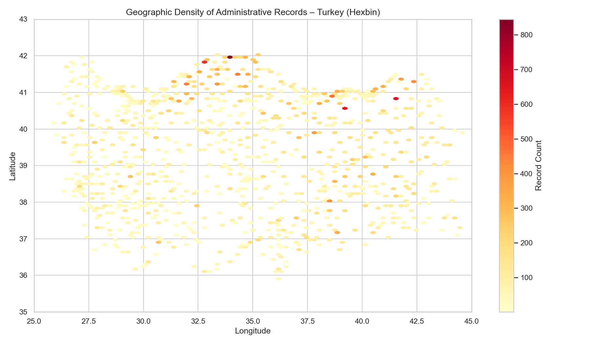
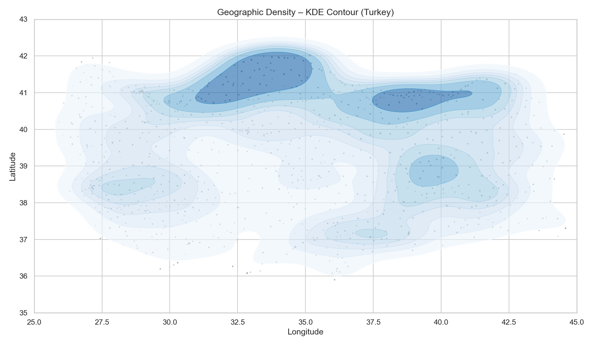
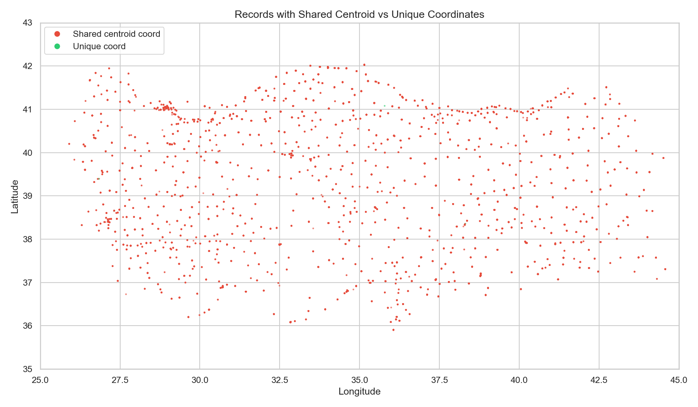
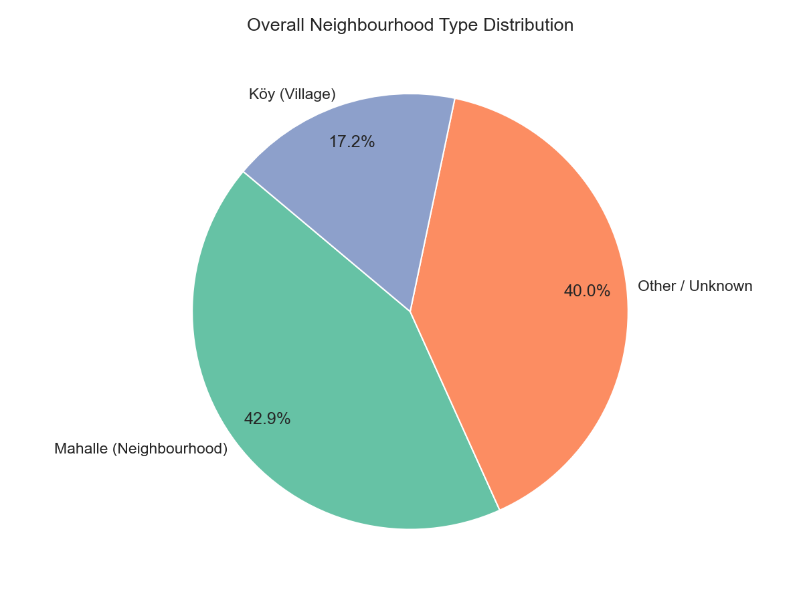
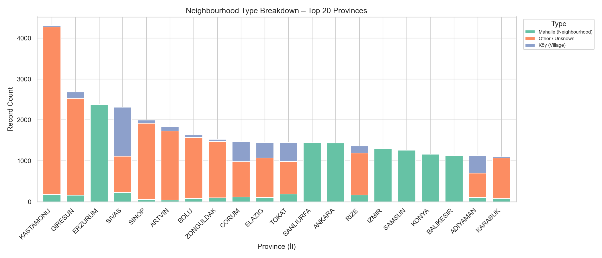
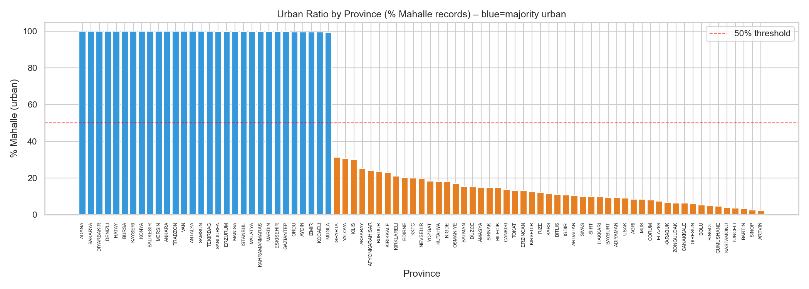
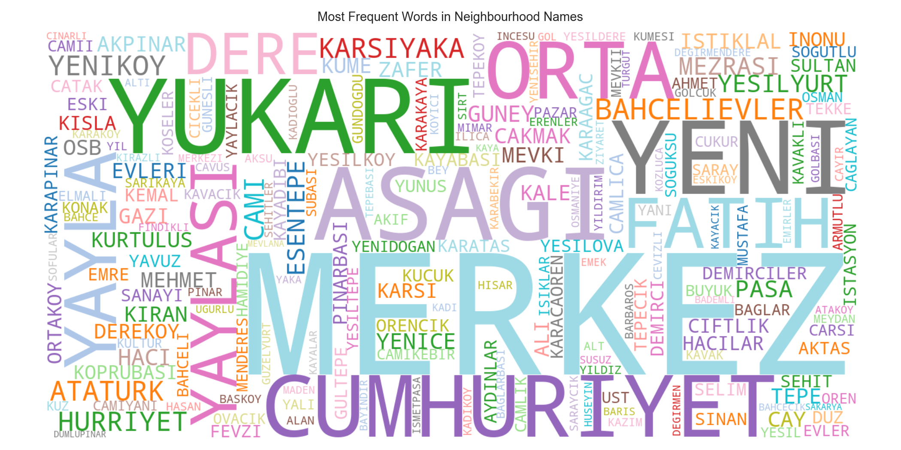
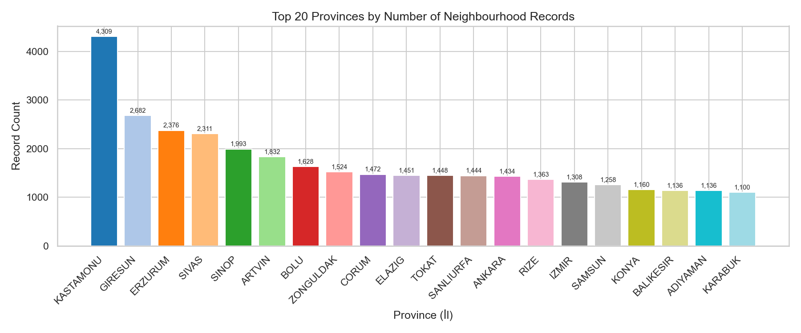
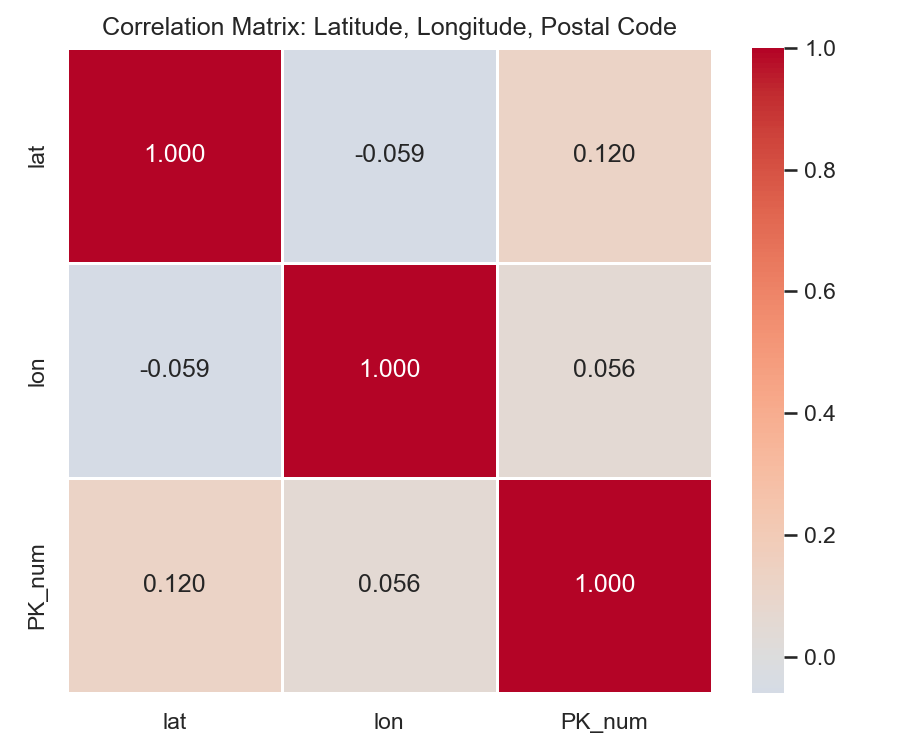
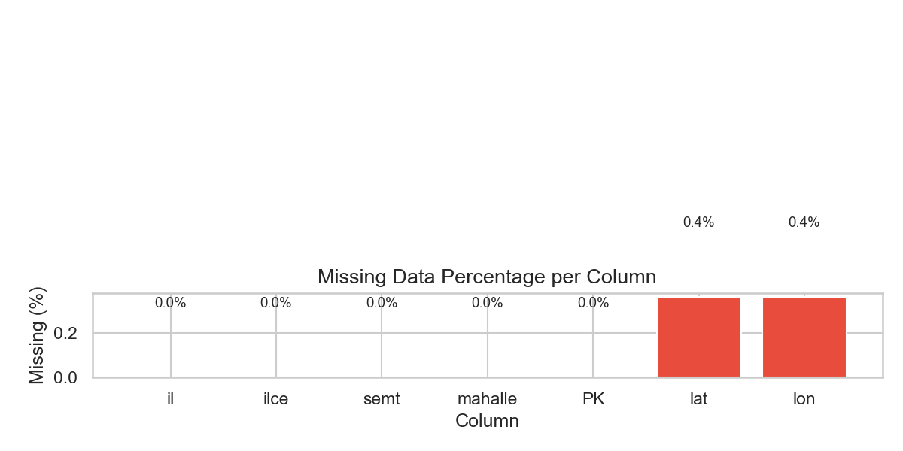

# TR/KKTC Postal Codes – Exploratory Data Analysis

CMP5101 Data Mining – Assignment I

## Dataset

**Turkey & Northern Cyprus (KKTC) Postal Codes Dataset (2025)**  
Source: [Kaggle – erogluegemen/turkey-postal-codes-dataset-2025](https://www.kaggle.com/datasets/erogluegemen/turkey-postal-codes-dataset-2025/code)

The dataset contains 74,342 records covering all provinces of Turkey and Northern Cyprus (KKTC), with the following columns:

| Column | Description | Type |
|---|---|---|
| `il` | Province | Categorical |
| `ilçe` | District | Categorical |
| `semt_bucak_belde` | Township / Town | Categorical |
| `Mahalle` | Neighbourhood / Village | Categorical |
| `PK` | Postal Code | Quasi-categorical |
| `Latitude` | Latitude (missing for KKTC) | Numeric |
| `Longitude` | Longitude (missing for KKTC) | Numeric |

## What the analysis covers

1. Feature types and meanings
2. Summary statistics
3. Missing data analysis
4. Duplicate detection and root-cause analysis
5. Histograms and box plots
6. Relationships between features (correlation, scatter plots)
7. Anomaly and error detection
8. Postal code → province validation
9. Neighbourhood type classification (Mahalle, Köy, Belde, etc.)
10. Geographic density heatmap (hexbin + KDE)
11. Province-level summary table
12. Postal code gap analysis
13. Word cloud of neighbourhood names
14. Coordinate precision analysis

## Key Findings

- **KKTC records (271)** have no latitude/longitude — coordinates are entirely missing for Northern Cyprus.
- **ERZURUM province is duplicated** — 2,376 out of 2,378 duplicate records all belong to Erzurum, indicating the whole province was entered twice.
- **79.4% of records share a district-level centroid** — coordinates are not per-neighbourhood GPS but rough district centroids.
- **Province code 70 (KARAMAN) is absent** from the postal code space despite being a valid Turkish province.
- Postal codes are heavily shared: up to **669 neighbourhoods share a single PK** (postal code `8890`).
- **40% of neighbourhood names** use no standard administrative suffix (MAH/KOY/BELDE), mostly rural and KKTC entries.
- All postal code prefixes correctly encode the province plate number (100% match after zero-padding).

## Sample Figures

### Geographic Density – Hexbin Map


### Geographic Density – KDE Contour


### Shared Centroid vs Unique Coordinates


### Neighbourhood Type Distribution


### Neighbourhood Type by Province (Top 20)


### Urban Ratio by Province


### Word Cloud of Neighbourhood Names


### Top Provinces by Record Count


### Correlation Heatmap


### Missing Data per Column


## Running the analysis

```bash
pip install pandas numpy matplotlib seaborn wordcloud
python eda.py
```

Figures are saved to the `figures/` directory. A province-level summary is exported as `province_summary.csv`.
